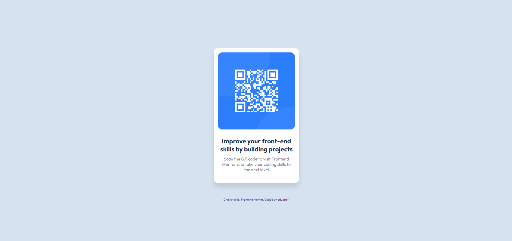

# Frontend Mentor - QR code component solution

This is a solution to the [QR code component challenge on Frontend Mentor](https://www.frontendmentor.io/challenges/qr-code-component-iux_sIO_H). Frontend Mentor challenges help you improve your coding skills by building realistic projects. 

## Table of contents

- [Overview](#overview)
  - [Screenshot](#screenshot)
- [My process](#my-process)
  - [Built with](#built-with)
  - [What I learned](#what-i-learned)
- [Author](#author)
- [Acknowledgments](#acknowledgments)

## Overview

### Screenshot

## My process

I looked at the designs and tried to find containers to fit the content. I identified one big container for the card and two containers for the image and text. The process took me 45min, I estimated it to take 2 hours.

### Built with

- Semantic HTML5 markup
- CSS custom properties
- Flexbox

### What I learned

I didn't need to use another div for the image, and just used it as is. Learned some behaviour of margin in regards to max-width.

## Author

- Frontend Mentor - [@aduatgit](https://www.frontendmentor.io/profile/aduatgit)

